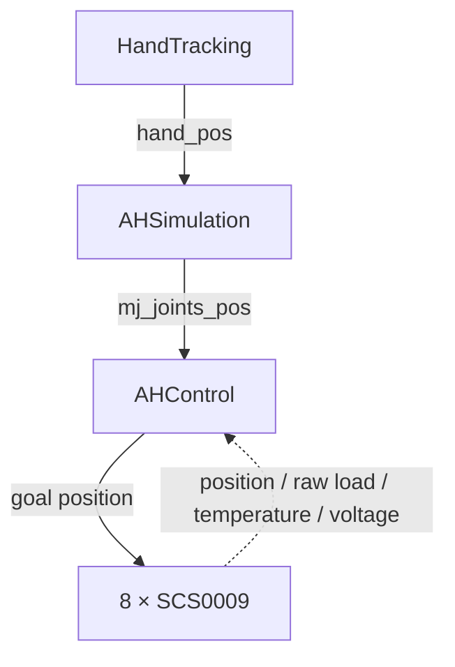

# 基于 SCS0009 舵机负载反馈的软抓取开发

这个分支记录我在 AmazingHand 原位置跟踪节点上加入负载反馈的第一阶段开发。

更准确的名称是“基于舵机负载反馈的软抓取”或“负载反馈柔性抓取”，而不是指尖力控制。八个 Feetech SCS0009 提供的 `raw_load` 没有在本项目中标定成牛顿；`estimated_load` 也只是经过机械预载补偿与滤波的内部量。

## 原链路与修改位置



虚线反馈是我在本地 `AHControl` 中新增的实验链路。原版上游固定快照使用 `r_hand_pos` / `mj_r_joints_pos`；当前本地软抓取副本使用不带 `r_` 的名称。

新增内容包括：

- 舵机位置、速度、负载、温度和电压读取；
- 逐个舵机 unicast 轮询；
- 负载低通滤波和启动基线；
- 接触连续帧确认；
- 闭合步长与目标速度限制；
- Tracking、Closing、Contact、Holding、Releasing、Fault 状态；
- 超载、过温、电压范围和反馈超时保护；
- `motor_feedback`、`grasp_state`、`safety_status` Dora 输出设计；
- 监控、标定和单指测试工具的设计记录。

## 视频对照

| 对照项 | 原版位置跟踪 | 加入负载反馈软抓取 |
| --- | --- | --- |
| 控制依据 | 目标位置 | 目标位置 + 舵机负载反馈 |
| 接触后策略 | 按原位置目标继续跟踪 | 按状态机限制继续闭合并保持 |
| 新增保护 | 以原项目为准 | 负载、温度、电压和反馈超时检查 |
| 画面可观察内容 | 人手与机械手做连续姿态跟踪 | 人手直接接触指尖时，机械手动作受修改后控制逻辑约束 |
| 演示视频 | [original_position_tracking.mp4](assets/videos/original_position_tracking.mp4) | [load_feedback_soft_grasp.mp4](assets/videos/load_feedback_soft_grasp.mp4) |

两段视频只能证明录制时观察到的运动差异，不能据此声称抓取力更小、成功率更高或安全性已得到验证。

为公开发布，我检查了抽样画面：没有发现人脸、终端、Token、可读设备序列号或私人绝对路径。仓库版移除了原始音轨和容器 metadata，视频画面未裁剪。

## 当前配置与状态

实际提供的 `r_hand.toml`：

```toml
[soft_grasp]
enabled = false
feedback_hz = 10
command_hz = 100
goal_speed_rad_s = 1.0
load_filter_alpha = 0.2
contact_confirm_samples = 5
release_confirm_samples = 3
max_position_step_rad = 0.01
communication_timeout_ms = 200
baseline_samples = 25
fault_action = "hold"
```

每根手指目前仍使用：

```toml
contact_load_threshold = 180
target_hold_load = 220
max_load = 450
```

这三项是未完成硬件标定的占位参数。默认 `enabled = false`，所以不传 `--soft-grasp` 时仍保持原位置跟踪行为。

## 阅读顺序

1. [功能边界与架构](docs/01_scope_and_architecture.md)
2. [真实开发顺序](docs/02_development_history.md)
3. [状态机与安全机制](docs/03_state_machine_and_safety.md)
4. [配置、频率和验证边界](docs/04_configuration_and_validation.md)
5. [视频内容记录](docs/05_video_notes.md)
6. [源码证据与缺失项](docs/06_source_evidence.md)
7. [代码来源与修改说明](SOURCE_PROVENANCE.md)

[返回 `main`](https://github.com/Zeil6/amazinghand-reproduction-and-soft-grasp)

