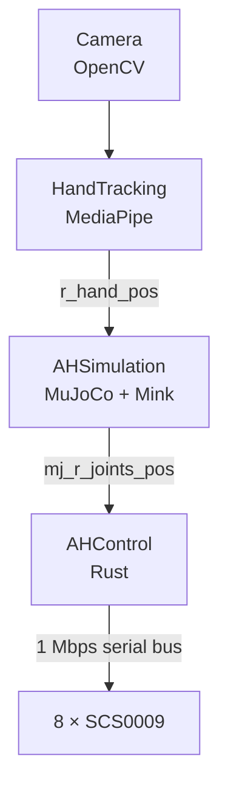

# AmazingHand 项目运行原理分析

这个分支关注“数据怎样从摄像头走到八个舵机”，而不是逐行翻译源码。

AmazingHand 的高级 demo 属于连续手部动作重定向：MediaPipe 每次给出手部关键点，代码计算四根手指的连续目标向量，Mink 再求解机械手八个模型关节。它不是把画面分类成“握拳、张开、OK”等离散手势。

## 总数据流

下面是上游 2026-07-27 固定快照的右手真机链路：

当前提供的本地副本把两个 topic 简化为 `hand_pos` 和 `mj_joints_pos`。文档会明确区分上游快照与本地工作副本。

## 阅读顺序

1. [HandTracking：关键点到四个目标](docs/01_hand_tracking.md)
2. [AHSimulation：MuJoCo 模型与 Mink IK](docs/02_ik_simulation.md)
3. [AHControl：八个目标到八个舵机](docs/03_hardware_control.md)
4. [Dora、Zenoh 与多频率数据流](docs/04_dora_dataflow.md)
5. [仿真/真机边界与从零拆分方法](docs/05_system_boundaries.md)

## 固定源码

- [HandTracking/main.py](https://github.com/pollen-robotics/AmazingHand/blob/3e8241074df3436a3044ced4881e3bb2133aa725/Demo/HandTracking/HandTracking/main.py)
- [AHSimulation/mj_mink_right.py](https://github.com/pollen-robotics/AmazingHand/blob/3e8241074df3436a3044ced4881e3bb2133aa725/Demo/AHSimulation/AHSimulation/mj_mink_right.py)
- [AHControl/main.rs](https://github.com/pollen-robotics/AmazingHand/blob/3e8241074df3436a3044ced4881e3bb2133aa725/Demo/AHControl/src/main.rs)
- [dataflow_tracking_real.yml](https://github.com/pollen-robotics/AmazingHand/blob/3e8241074df3436a3044ced4881e3bb2133aa725/Demo/dataflow_tracking_real.yml)

我后来在控制层增加的反馈实验见 [`soft-grasp-development`](https://github.com/Zeil6/amazinghand-reproduction-and-soft-grasp/tree/soft-grasp-development)。这里不重复完整开发过程。

[返回 `main`](https://github.com/Zeil6/amazinghand-reproduction-and-soft-grasp)

