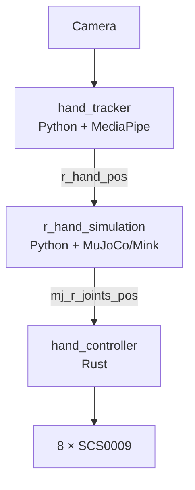

# 02 AmazingHand 数据流

## 上游固定快照



上游 [`dataflow_tracking_real.yml`](https://github.com/pollen-robotics/AmazingHand/blob/3e8241074df3436a3044ced4881e3bb2133aa725/Demo/dataflow_tracking_real.yml) 声明：

- `hand_tracker`：50 ms timer，理论 20 Hz；
- `r_hand_simulation`：2 ms IK tick，10 ms 控制输出 tick；
- `hand_controller`：订阅 `mj_r_joints_pos`。

## 本地副本差异

当前提供的本地 `main.py` 和 `mj_mink_right.py` 使用：

```text
hand_pos -> mj_joints_pos
finger1 ... finger4
```

而不是上游快照的：

```text
r_hand_pos -> mj_r_joints_pos
r_finger1 ... r_finger4
```

这不是概念差异，而是源码版本/本地修改差异。YAML、Python `send_output()` 和 Rust input 必须三处一致。

## 消息里传的是什么

`hand_pos` 不是“手势类别”。它包含四个目标向量：

```text
r_tip1: index finger tip relative to MCP, transformed into palm frame
r_tip2: middle finger
r_tip3: ring finger
r_tip4: thumb
```

AHSimulation 把目标写入 MuJoCo mocap site，Mink 求解满足四个 FrameTask 和 equality/posture 约束的配置，再输出八个电机关节位置。

Rust 节点利用 metadata 中的手指索引映射，知道数组中 `[0,1]` 对应 finger1，依此类推。

## Dora timer 与普通消息

timer 是由 dataflow 定义的周期输入；`hand_pos` 和 `mj_joints_pos` 是节点输出连接形成的消息输入。Dora 决定何时把事件交给节点，业务代码决定收到事件后做什么。

