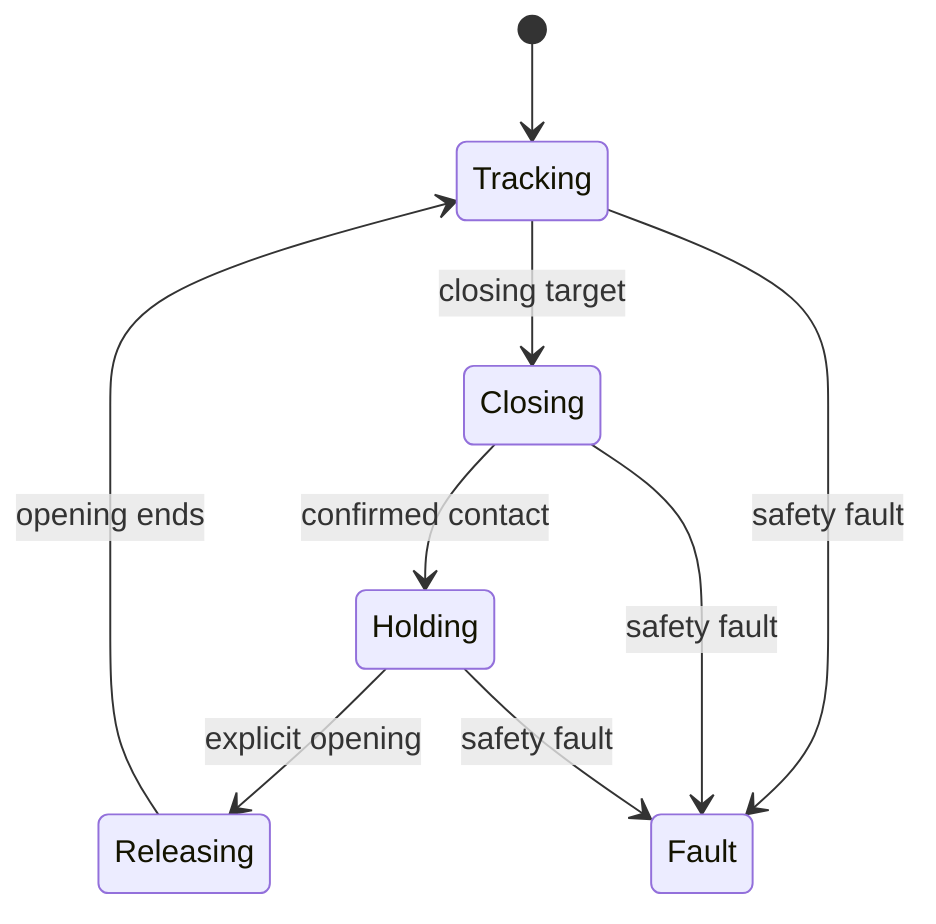

# 03 状态机与安全机制

## 状态



源码还定义 `Contact`。当前实现达到连续接触样本后先赋值 `Contact`，随后在同一次 `update()` 中立即转成 `Holding`；因此 `Contact` 更像一个内部瞬时过渡，不一定作为完整输出周期被观察到。

## Tracking

初始状态。没有闭合进展时保持跟踪。收到正向闭合进展后进入 Closing。

## Closing

每次命令的两个电机目标都限制在前一目标的：

```text
± max_position_step_rad
```

接触不是由单个 raw spike 决定；必须让 estimated load 连续达到 `contact_confirm_samples`。

## Holding

接触确认后保存 `hold_target`。Holding 不继续追随任意更大的闭合 IK 目标。

若 estimated load 低于：

```text
target_hold_load - hold_deadband
```

源码允许一个不超过 `0.002 rad` 的微小额外闭合步长。这个行为仍依赖未标定阈值，不能描述成精确恒力保持。

## Releasing

明确张开命令必须能绕过 Holding，否则操作者可能被接触锁定困住。

当前源码对 opening 立即进入 Releasing。虽然配置存在 `release_confirm_samples = 3`，运行时只递增 `release_samples`，没有用它作为释放门槛。这是当前源码与配置意图之间的待完善点。

张开能绕过 Holding，但不能自动绕过 Fault；Fault 恢复策略仍需明确设计。

## Fault

来源包括：

- estimated load 超过 `max_load`；
- temperature 超过 `max_temperature_c`；
- voltage 超出 `[min_voltage_v, max_voltage_v]`；
- feedback invalid 或超过 `communication_timeout_ms`；
- 枚举中还保留 Communication fault。

安全优先级是：

```text
feedback timeout
  -> over temperature
  -> voltage out of range
  -> per-finger overload
```

## `hold`、`backoff`、`torque_off`

| 动作 | 含义 | 风险 |
| --- | --- | --- |
| `hold` | 保持最后目标和扭矩 | 可能继续维持负载，但避免突然掉落 |
| `backoff` | 按 closing sign 反向一个小步 | 可能释放过载，但方向配置错误会放大风险 |
| `torque_off` | 关闭八个舵机扭矩 | 能去除驱动力，也可能让物体或机构突然掉落 |

`fault_action` 用于运行时 Fault；`shutdown_action` 用于节点退出清理，两者不是同一个时机。

实际配置默认：

```toml
fault_action = "hold"
shutdown_action = "hold"
```

默认选择保守地避免意外掉落，但它不等于所有故障下都最安全。安装到机械臂、有人协作或抓持重物时，需要按风险场景重新评估。

