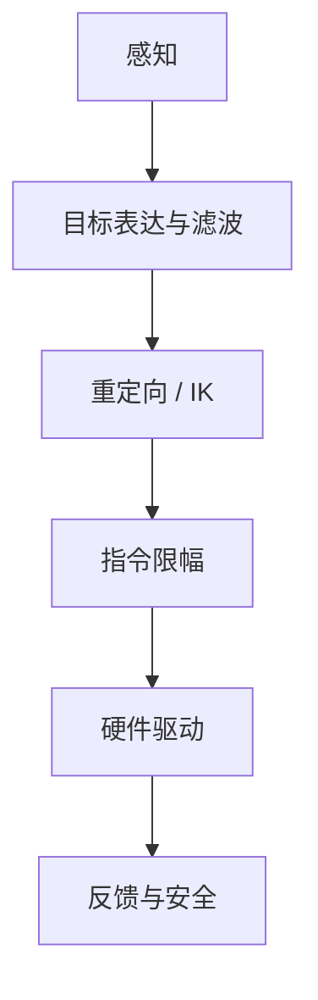

# 05 系统边界与从零拆分方法

## 最容易混淆的概念

| 概念 | 它实际表示什么 |
| --- | --- |
| 手势跟踪 | 连续四指目标，不是离散类别分类 |
| MuJoCo | 当前主要提供模型、状态和 Viewer，不等于完整接触动力学 |
| Mink | 求解满足任务约束的微分 IK |
| Dora | 节点编排和消息传递，不负责求 IK |
| Rust | AHControl 的实现语言 |
| Cargo | Rust package/依赖/构建工具 |
| raw load | 舵机原始负载反馈，不是指尖牛顿力 |
| offset | 机械零位补偿，不是 IK 目标本身 |

## 如果从零开发相似系统

配套模块：

| 模块 | 最小职责 |
| --- | --- |
| 感知 | 帧、关键点、置信度、timestamp、tracking lost |
| 目标表达 | 坐标系、尺度、滤波、离群值 |
| IK | 模型、约束、dt、求解失败 |
| 指令限幅 | position/velocity/acceleration、超时 |
| 驱动 | 协议、ID、offset/invert、同步写 |
| 通信 | node、topic、schema、lifecycle |
| 反馈与安全 | position/load/temp/voltage、watchdog、fault action |
| 验证 | 单节点、仿真、单指、全手、接触、故障注入 |

## 当前项目的边界

原版 demo 已经把感知、重定向和基础位置驱动连接起来，但仍缺少完备的 tracking lost、命令年龄、反馈闭环和统一安全状态。

后续软抓取分支在硬件控制层加入了第一阶段反馈，但尚未解决：

- 指尖真实力标定；
- 完整串口调度；
- 自动 Fault 恢复；
- 所有阈值的机械手个体标定；
- 接触动力学和滑移检测；
- 可复现的硬件 benchmark。

因此更准确的定位是“可运行 demo + 实验性反馈控制”，不是已完成的工业级抓取系统。

